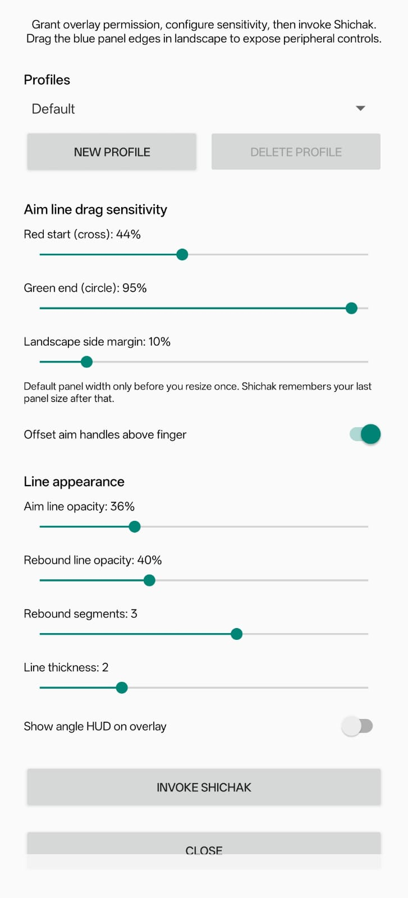
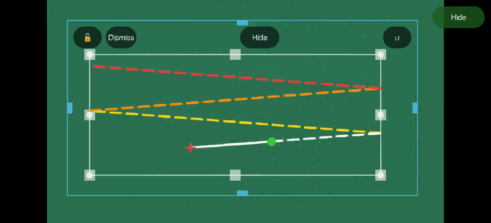
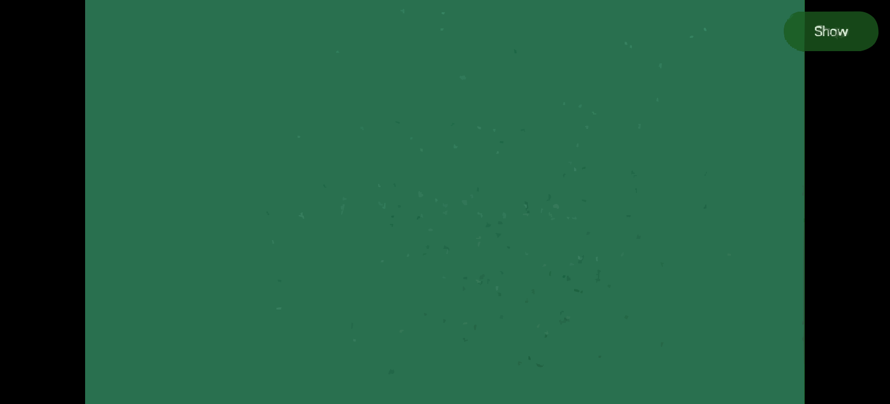
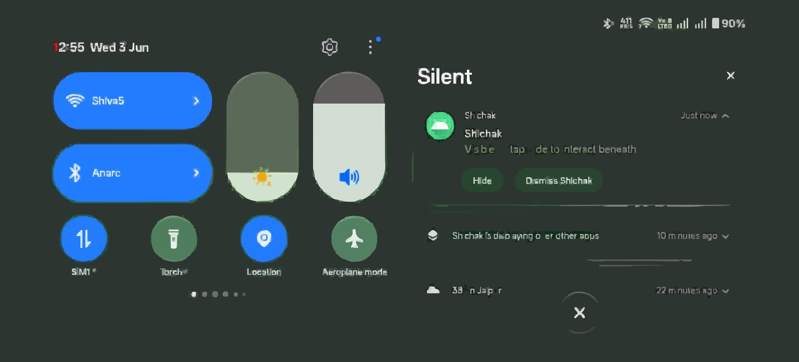
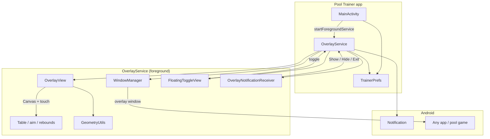

# Pool Trainer

A standalone Android overlay app that sits on top of any pool or billiards game. You manually align a table boundary rectangle and an aim line; the app draws rebound paths using pure geometry—no computer vision, no screen capture, and no game integration required.

> **Shipped app name:** When you build and install the APK (`./gradlew assembleDebug` or release), the on-device app is branded **Shichak** (`applicationId` `com.example.shichak`)—launcher label, notifications, and in-overlay controls use that name. Some labels differ from this document (e.g. **Show** / **Hide** instead of “Show Trainer” / “Hide Trainer”). This README describes behavior and architecture; the generated APK is the **Shichak** product build.

---

## Table of contents

- [Screenshots](#screenshots)
- [Features](#features)
- [Requirements](#requirements)
- [Quick start](#quick-start)
- [Usability guide](#usability-guide)
- [Configuration](#configuration)
- [Architecture](#architecture)
- [Project structure](#project-structure)
- [Geometry engine](#geometry-engine)
- [Persistence](#persistence)
- [Permissions](#permissions)
- [Building from source](#building-from-source)
- [Limitations](#limitations)
- [Disclaimer](#disclaimer)
- [License](#license)

---

<h2 id="screenshots">Screenshots</h2>

Add PNG or JPEG captures under `docs/screenshots/` (same base names). SVG placeholders ship with the repo so previews work until you replace them.

<h3 id="screenshot-main">Main screen (settings)</h3>

<p align="center">
  
</p>

<h3 id="screenshot-aim">Aim line and rebounds</h3>

<p align="center">
  
</p>

<h3 id="screenshot-toggle">Floating Show / Hide pill</h3>

<p align="center">
  
</p>

<h3 id="screenshot-notification">Notification controls</h3>

<p align="center">
  
</p>

---

<h2 id="features">Features</h2>

| Area | What you get |
|------|----------------|
| **Overlay** | Transparent trainer panel drawn above any app via `TYPE_APPLICATION_OVERLAY` |
| **Table rectangle** | White border, 6 pocket markers, 8 resize handles (corners + edge midpoints) |
| **Lock** | Freeze the table rect while still adjusting the aim line |
| **Aim line** | White line; **red cross** = shot origin, **green circle** = target end |
| **Rebounds** | Up to **5** configurable dashed rebounds (gold → orange → red → purple → cyan); default **3** |
| **Extension** | White dotted segment from the green end to the table boundary when the line stops short |
| **Line appearance** | Aim and rebound **opacity** sliders; **line thickness** (5 levels, default level 3); live update while overlay runs |
| **Angle HUD** | Optional overlay readout: cut angle, bank angle, distance to first cushion (off by default) |
| **Aim handle offset** | Optional offset so the red cross sits above your finger while dragging (on by default) |
| **Resizable panel** | Shrink the overlay in landscape so side game controls (cue stick, fine aim) stay touchable |
| **Hide / Show** | Remove the overlay from the screen without stopping the service; aim and table layout stay in memory for the session |
| **Floating toggle** | Draggable Show/Hide pill — drag to reposition; tap to toggle overlay |
| **Notification** | Foreground-service controls: Show, Hide, Exit |
| **Drag sensitivity** | Separate % sliders for red (start) and green (end) aim handles |
| **Profiles** | **Default** profile always available; create named profiles to save separate layouts and settings per game |
| **Remember layout** | Overlay panel, table rectangle, aim line, lock state, toggle position, and settings persist per profile |

---

<h2 id="requirements">Requirements</h2>

- **Android 8.0+** (API 26+)
- **Display over other apps** permission (`SYSTEM_ALERT_WINDOW`)
- **Notifications** permission on Android 13+ (`POST_NOTIFICATIONS`) for the foreground service notification
- A pool game (or any app) running underneath—the trainer does not hook into the game

---

<h2 id="quick-start">Quick start</h2>

1. Install the APK (debug: `app/build/outputs/apk/debug/app-debug.apk` after a local build).
2. Open **Pool Trainer**.
3. Grant **Display over other apps** when prompted (Settings opens automatically if needed).
4. Optionally adjust sensitivity, line appearance, profiles, and other settings on the main screen.
5. Tap **Invoke Shichak** — the app moves to the background and the foreground service starts.
6. Open your pool game.
7. Tap **Show** on the floating pill or from the notification.
8. Align the white table rectangle with the in-game table, place the aim line, then **Hide** when you want unobstructed touches on the game.

---

<h2 id="usability-guide">Usability guide</h2>

### First-time setup

1. **Table rectangle** — Drag corner or edge handles (small white squares) to match the playable table. Drag the **border** (not the empty interior) to move the whole rect.
2. **Lock** — Tap **🔓** in the toolbar when the table is aligned. The handles disappear and the rect stays fixed; you can still move the aim line.
3. **Aim line** — Drag the **red cross** (farther from the table = shot origin) and **green circle** (target end). Rebounds update live. Enable **Offset aim handles above finger** on the main screen if the cross hides under your thumb.
4. **Reset aim** — Tap **↺** to restore the default aim line inside the panel.
5. **Floating pill** — **Drag** the green Show/Hide pill to move it away from game UI; **tap** to show or hide the overlay.

### Playing with the game

- **Hide Trainer** — Overlay is removed; touches go to the game. Your aim line and table setup remain for this service session.
- **Show Trainer** — Brings the overlay back with the same aim and table.
- **Touches outside the panel** — In landscape, after narrowing the panel, taps on the left/right (or top/bottom) strips reach the game—useful for cue stick and fine-control UI on the edges.

### Resizing the trainer panel (landscape)

The overlay is a **blue-bordered panel**, not always full screen.

1. Drag the **cyan squares** at the **center** of each panel edge (left, right, top, bottom).
2. The **white table rectangle does not shrink** until the panel becomes smaller than the rect; then it clamps inward.
3. Toolbar buttons (**Lock**, **Exit**, **Hide**, **↺**) stay laid out inside the panel as you resize.
4. The last panel **position and size are saved** after you resize once; the next **Start Trainer** restores them.

### Stopping the trainer

| Action | Effect |
|--------|--------|
| **Exit** (toolbar) | Stops the foreground service and removes overlay + floating button |
| **Exit** (main screen) | Stops the service and closes the app |
| **Exit Trainer** (notification) | Same as toolbar Exit |

### Typical workflow

```text
Configure on main screen → Start Trainer → open game
    → Show Trainer → align table → lock table → set aim line
    → Hide Trainer → play using game controls + mental/visual aim from trainer
    → Show Trainer again to tweak aim → Hide → play …
    → Exit when done
```

---

<h2 id="configuration">Configuration</h2>

Settings on the main screen (stored in `SharedPreferences`, `shichak_prefs`). Layout and most settings are **scoped to the active profile** (see [Persistence](#persistence)).

### Profiles

| Control | Purpose |
|---------|---------|
| **Profile spinner** | Switch between **Default** and any custom profiles |
| **New profile** | Copies the current profile’s layout and settings into a new named profile and switches to it |
| **Delete profile** | Removes a custom profile (Default cannot be deleted) |

You start on **Default** automatically — no setup required. Create a profile only when you want a separate saved layout (e.g. a different pool game or orientation).

### Aim and panel

| Setting | Default | Range | Purpose |
|---------|---------|-------|---------|
| **Red start (cross) drag %** | 45% | 1–100% | How closely the red end follows your finger (lower = finer control) |
| **Green end (circle) drag %** | 95% | 1–100% | Same for the green end |
| **Landscape side margin %** | 12% | 5–40% | Initial panel width in landscape **only before** you resize the panel manually |
| **Offset aim handles above finger** | On | On/Off | Keeps the red cross visible above your finger while dragging |

### Line appearance

| Setting | Default | Range | Purpose |
|---------|---------|-------|---------|
| **Aim line opacity** | 75% | 10–100% | Translucency of the white aim line and dotted extension |
| **Rebound line opacity** | 70% | 10–100% | Translucency of dashed rebound segments |
| **Rebound segments** | 3 | 0–5 | How many cushion bounces to draw after the first hit |
| **Line thickness** | 3 | 1–5 | Stroke width for aim and rebound lines (level 3 = original thickness) |
| **Show angle HUD on overlay** | Off | On/Off | Cut angle, bank angle, and distance to first cushion in a corner HUD |

After you resize the panel with the cyan handles, **saved panel bounds override** the landscape margin default. Slider changes apply to the running overlay immediately when Shichak is active.

---

<h2 id="architecture">Architecture</h2>

High-level flow:



### Components

| Class | Role |
|-------|------|
| **`MainActivity`** | Permissions (overlay, notifications), settings UI, start/stop `OverlayService` |
| **`OverlayService`** | Foreground service; owns `WindowManager` layout; panel size/position; show/hide overlay |
| **`OverlayView`** | Custom `View`: all drawing, touch handling, table/aim state, panel-edge resize callbacks |
| **`FloatingToggleView`** | Always-on-top pill to show/hide the trainer without stopping the service |
| **`OverlayNotificationReceiver`** | Handles notification broadcast actions (show, hide, exit) |
| **`TrainerPrefs`** | SharedPreferences helpers: drag %, landscape margin, overlay panel bounds |
| **`GeometryUtils`** | Ray–rectangle intersection, reflection, vector math for rebounds |

### Window model

Unlike a single full-screen overlay, the trainer uses a **positioned panel**:

```text
Screen
├── FloatingToggleView     (small, top-end; always when service runs)
└── OverlayView panel      (x, y, width, height — persisted)
        ├── Cyan border + edge handles (panel resize)
        ├── Toolbar: Lock | Exit | Hide | Reset
        ├── Table rectangle + handles (when unlocked)
        ├── Aim line + rebounds + extension
        └── Transparent interior → game visible underneath
```

When the overlay is **hidden**, `OverlayView` is removed from `WindowManager` but the instance (and aim line) are kept until the service stops.

### Touch priority (`OverlayView.hitTest`)

Handled in order (first match wins):

1. Toolbar buttons (Hide, Lock, Exit, Reset)
2. Aim endpoints (red / green hit radii)
3. Table handles and border drag (if unlocked)
4. Panel edge handles (cyan midpoint — panel resize)
5. Other touches inside the panel → consumed (no pass-through to game)
6. Touches **outside** the panel window → delivered to the app below

### Draw order (`onDraw`)

1. Panel border (cyan) and panel resize handles  
2. Table border, pockets, table handles  
3. Rebound segments (up to 5, configurable colors)  
4. Aim line, dotted extension, red cross, green circle  
5. Optional angle HUD (bottom-left)  
6. Toolbar pills  

### Service lifecycle

```text
Start Trainer → OverlayService.onCreate
    → load panel bounds (saved or default)
    → show FloatingToggleView + notification
Show → add OverlayView with panel LayoutParams
Hide → remove OverlayView, persist panel bounds
Exit / stopSelf → onDestroy, persist bounds, tear down windows
```

---

<h2 id="project-structure">Project structure</h2>

```text
Pool/
├── app/
│   ├── src/main/
│   │   ├── AndroidManifest.xml
│   │   ├── java/com/example/shichak/
│   │   │   ├── MainActivity.kt
│   │   │   ├── OverlayService.kt
│   │   │   ├── OverlayView.kt
│   │   │   ├── FloatingToggleView.kt
│   │   │   ├── OverlayNotificationReceiver.kt
│   │   │   ├── ShichakPrefs.kt
│   │   │   ├── ScreenLayout.kt
│   │   │   └── GeometryUtils.kt
│   │   └── res/
│   │       ├── layout/activity_main.xml
│   │       ├── values/strings.xml, colors.xml, themes.xml
│   │       └── drawable/ …
│   └── build.gradle.kts
├── gradle/ …
└── README.md
```

**Package:** `com.example.shichak`  
**Tech:** Kotlin, Android Views + `Canvas`, AppCompat, no Jetpack Compose, no third-party geometry libraries.

---

<h2 id="geometry-engine">Geometry engine</h2>

Rebounds are computed in `GeometryUtils` and `OverlayView.computeAimGeometry()`:

1. Determine **start** vs **end** of the aim line (endpoint farther from the table rect is the ray origin).
2. Cast a ray from start through end; find the first intersection with the table rect → **Hit1**.
3. Reflect the direction about the hit side’s normal; cast from Hit1 → **Hit2**, and repeat up to the configured rebound count (0–5).

Reflection: `reflected = direction - 2 * dot(direction, normal) * normal`

When **angle HUD** is enabled, the overlay shows:

| HUD field | Meaning |
|-----------|---------|
| **Cut** | Incidence angle at the first cushion hit (degrees) |
| **Bank** | Direction of the first rebound segment (degrees from horizontal) |
| **Dist** | Pixel distance from shot origin to first cushion hit |

| Element | Color | Style |
|---------|-------|--------|
| Aim line | White | Solid |
| Rebound 1 | `#FFD700` | Dashed |
| Rebound 2 | `#FF8C00` | Dashed |
| Rebound 3 | `#FF3333` | Dashed |
| Rebound 4 | `#AA66FF` | Dashed |
| Rebound 5 | `#33CCCC` | Dashed |
| Extension (green → table) | White | Dotted |

Rebounds appear when the aim ray intersects the table rectangle. `Paint` and `DashPathEffect` objects are created once per view, not per frame.

---

<h2 id="persistence">Persistence</h2>

All keys live in `shichak_prefs` (`ShichakPrefs.PREFS_NAME`).

### Profiles

- **Default profile** uses the original unprefixed keys (backward compatible).
- **Custom profiles** store the same keys with a `profile_{name}_` prefix.
- Active profile id: `pref_active_profile` (default `"default"`).
- Custom profile names: `pref_custom_profiles` (string set).

Each profile saves:

| Data | Keys (Default profile) |
|------|------------------------|
| Overlay panel margins | `pref_overlay_margin_l/t/r/b` |
| Table rect margins + lock | `pref_rect_margin_*`, `pref_rect_locked` |
| Aim line points | `pref_aim1_margin_l/t`, `pref_aim2_margin_l/t` |
| Floating toggle position | `pref_toggle_margin_r/t` |
| Drag sensitivity, landscape margin, opacity, rebound count, thickness, HUD, offset | `pref_*` settings keys |

| Keys | Saved when | Restored when |
|------|------------|---------------|
| Overlay / table / aim / toggle | Layout changes, hide, destroy, profile switch | Service start, profile switch, orientation change |
| Settings sliders / switches | Main screen changes | Main screen + overlay (live via config broadcast) |

Panel bounds use synchronous `commit()` on hide/destroy and when a panel resize gesture ends. Switching profiles reloads the overlay layout and toggle position immediately if the service is running.

---

<h2 id="permissions">Permissions</h2>

| Permission | Why |
|------------|-----|
| `SYSTEM_ALERT_WINDOW` | Draw the trainer and floating toggle over other apps |
| `FOREGROUND_SERVICE` / `FOREGROUND_SERVICE_SPECIAL_USE` | Keep the overlay reliable while you play (Android 14+ special-use FGS) |
| `POST_NOTIFICATIONS` | Show the ongoing trainer notification (Android 13+) |

The manifest declares a special-use FGS subtype: *"Shichak geometry overlay"*.

---

<h2 id="building-from-source">Building from source</h2>

### Prerequisites

- Android Studio (Ladybug or newer) or command-line SDK
- **JDK 17** recommended for Gradle (e.g. Amazon Corretto 17)

### Build debug APK

```bash
cd Pool
./gradlew assembleDebug
```

Output: `app/build/outputs/apk/debug/app-debug.apk`

The installed app appears as **Shichak** on the launcher and in the system UI (not “Pool Trainer”). Package name: `com.example.shichak`.

With an explicit Java home:

```bash
JAVA_HOME=/path/to/jdk-17 ./gradlew assembleDebug
```

### Run from Android Studio

1. Open the `Pool` project root.
2. Select the `app` configuration and a device/emulator (API 26+).
3. Run — grant overlay permission on the device before **Start Trainer** works.

### Versions (from `app/build.gradle.kts`)

| Setting | Value |
|---------|--------|
| `minSdk` | 26 |
| `targetSdk` | 36 |
| `compileSdk` | 36 |
| `applicationId` | `com.example.shichak` |
| Launcher / app label (APK) | **Shichak** |

---

<h2 id="limitations">Limitations</h2>

- **Manual alignment only** — no auto-detection of the table or balls.
- **No screen recording or accessibility scraping** — by design.
- **Aim line resets** when the foreground service is fully stopped and started again (table rect and panel size still restore).
- **Panel bounds are pixel-based** — rotation or large resolution changes may require minor re-adjustment; bounds are clamped to the current screen on load.
- **Touches inside the visible panel** do not reach the game; use **Hide Trainer** or a narrower panel for full-table play.
- **Emulator overlay** behavior can differ from physical devices; test on a real phone for touch and overlay permission flows.

---

<h2 id="disclaimer">Disclaimer</h2>

<p align="center">
  <strong><span style="color:#D32F2F">USE AT YOUR OWN RISK</span></strong>
</p>

<p>
  <strong><span style="color:#D32F2F">Shichak is an unofficial overlay tool.</span></strong>
  You are solely responsible for how you use it. The authors and contributors are
  <strong><span style="color:#D32F2F">not liable</span></strong>
  for account bans, penalties, data loss, device issues, or any other harm arising from
  use of this software, interference with other apps or games, or reliance on on-screen
  aim geometry. You must comply with the terms of any game or platform you use
  alongside this app.
</p>

<p>
  <strong><span style="color:#D32F2F">By installing or using Shichak, you accept this disclaimer.</span></strong>
</p>

---

<h2 id="license">License</h2>

[MIT License](LICENSE) — use, copy, modify, merge, publish, distribute, sublicense, and sell copies; no warranty. Keep the copyright notice in distributions. The disclaimer above applies in addition to the license terms.

---

## Contributing

Issues and pull requests are welcome. When changing touch behavior, panel sizing, or geometry, update this README if user-visible behavior changes.
